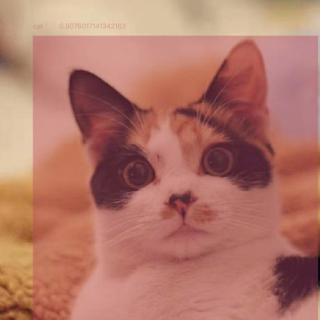
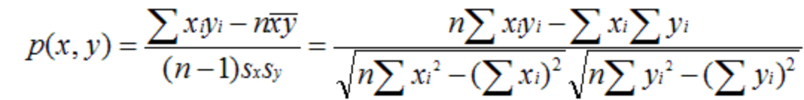

# shakeYhead
> 基于深度学习的姿势/动作识别匹配系统

## demo

### 图像分类器训练
基于迁移模型，通过极少量的二次训练获取一个图像分类器


### 人体姿势匹配
先计算出示例图中人物的动作节点，然后通过摄像头捕捉你的关键节点，计算出两者之间的差异，得出一个相似度分数（0-100）


### 物品识别
基于迁移模型，通过自定义分类器和筛选条件进行指定物品的识别/提取


## Core

向量相似性的JS实现



```JavaScript
async function compute(x, y) {
    x = tf.tensor1d(x);
    y = tf.tensor1d(y);
    const p1 = tf.sqrt(x.mul(x).sum());
    const p2 = tf.sqrt(y.mul(y).sum());
    let p12 = x.mul(y).sum();
    let score = p12.div(p1.mul(p2));
    score = ((await score.data())[0] - 0.9) * 10;
    logEle.innerText = score;
    logBar.style.transform = 'scaleX(' + score + ')';
    if (score > 0.85) {
        stop();
        logBar.style.background = 'green';
    } else logBar.style.background = 'brown';
}
```

## Use
```bash
yarn install && yarn start
```

## Dependence
* [TensorFlow](https://www.tensorflow.org/js)
